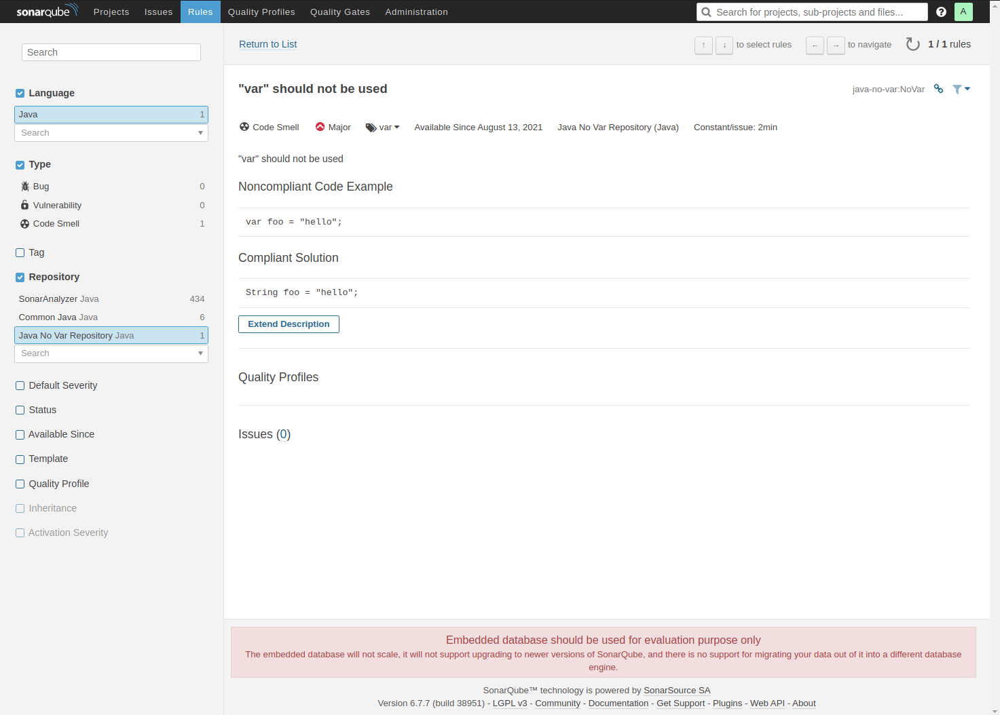

# Sonar Java No Var Plugin

A sonar plugin deploying a rule against java 'var' usage

# Installation

Put the plugin jar in `/opt/sonarqube/extensions/plugins/` then restart SonarQube.

In the `Rules` tab, you should find the `No Var` rule:

